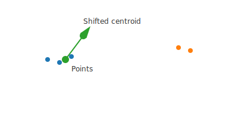

Algorithm design — Mean Shift
=============================

W tym rozdziale przedstawiamy projekt i matematyczne podstawy algorytmu Mean Shift
użytego w tym projekcie. Zakres: intuicja, notacja, pseudokod, złożoność i przykłady
z ilustracjami.

Overview
--------

Mean Shift to algorytm grupowania (clustering) typu non-parametric, który
szuka trybów (modes) rozkładu gęstości poprzez iteracyjne przesuwanie
punktów w stronę lokalnego środka masy w obrębie określonego okna (bandwidth).

Notacja i równania
------------------

Niech X = {x_i}_{i=1..n} oznacza zbiór punktów w R^d. Dla punktu x definiujemy
sąsiedztwo N(x) = {x_i : ||x_i - x|| < h}, gdzie h to bandwidth (promień).
Wersja "flat kernel" (równo ważone punkty) aktualizuje punkt x do:

.. math::
   x' = \frac{1}{|N(x)|}\sum_{x_i\in N(x)} x_i

Wektor mean-shift można zapisać jako różnicę między nową pozycją a starą:

.. math::
   m(x) = x' - x

Pseudokod
----------

.. code-block:: text

   Algorytm MeanShift(X, h, max_iter, tol):
       centroids = X.copy()
       for t in range(max_iter):
           prev = centroids.copy()
           for i, c in enumerate(centroids):
               neighbors = {x for x in X if ||x - c|| < h}
               if neighbors:
                   centroids[i] = mean(neighbors)
           if ||centroids - prev|| < tol:
               break
       return prune_centroids(centroids, h)

Złożoność i uwagi praktyczne
----------------------------

- Złożoność brutto: O(n^2) na iterację przy prostym implementowaniu (liczenie
  odległości między wszystkimi parami punktów); można przyspieszyć stosując
  struktury przestrzenne (KDTree) lub przybliżone wyszukiwanie sąsiadów.
- Wybór bandwidth ma kluczowy wpływ: małe h => więcej klastrów; duże h => mniej.
- Konwergencja zależy od tolerancji i liczby iteracji.

Ilustracja działania
--------------------

   Przykładowy krok Mean Shift: punkty (kropki) i przesunięcie centroidu (strzałka).

Przykład użycia
----------------

Poniższy przykład demonstruje prosty przebieg algorytmu.

.. literalinclude:: ../docs/examples/mean_shift_example.py
   :language: python

Referencje
----------

- Comaniciu, D. and Meer, P. (2002). Mean shift: A robust approach toward feature
  space analysis. IEEE Transactions on Pattern Analysis and Machine Intelligence.
