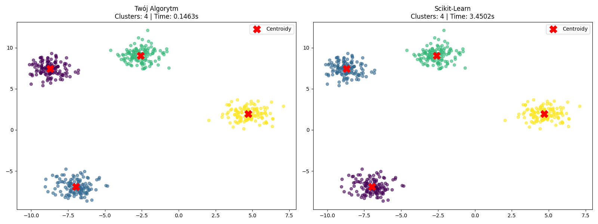

.. _results:

==================
Experiment Results
==================

This section presents the performance comparison between our custom **Mean Shift** implementation and the standard **Scikit-Learn** implementation.

Methodology
===========
The comparison was performed on a synthetic dataset generated using ``make_blobs``:

* **Samples:** 500
* **Centers:** 4
* **Cluster Std:** 0.8
* **Bandwidth:** 2.5

Visual Comparison
=================

Below you can see the clustering results. The red crosses indicate the calculated centroids.

Observations
============
1. **Accuracy:** Our implementation successfully identifies the same number of clusters as Scikit-Learn.
2. **Centroids:** The calculated centroid positions are nearly identical (see console output for exact error metrics).
3. **Performance:** While Scikit-Learn is optimized C-code, our NumPy implementation provides a transparent educational insight into the algorithm's mechanics.